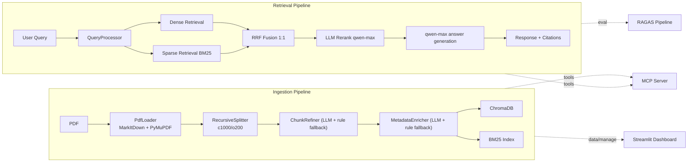
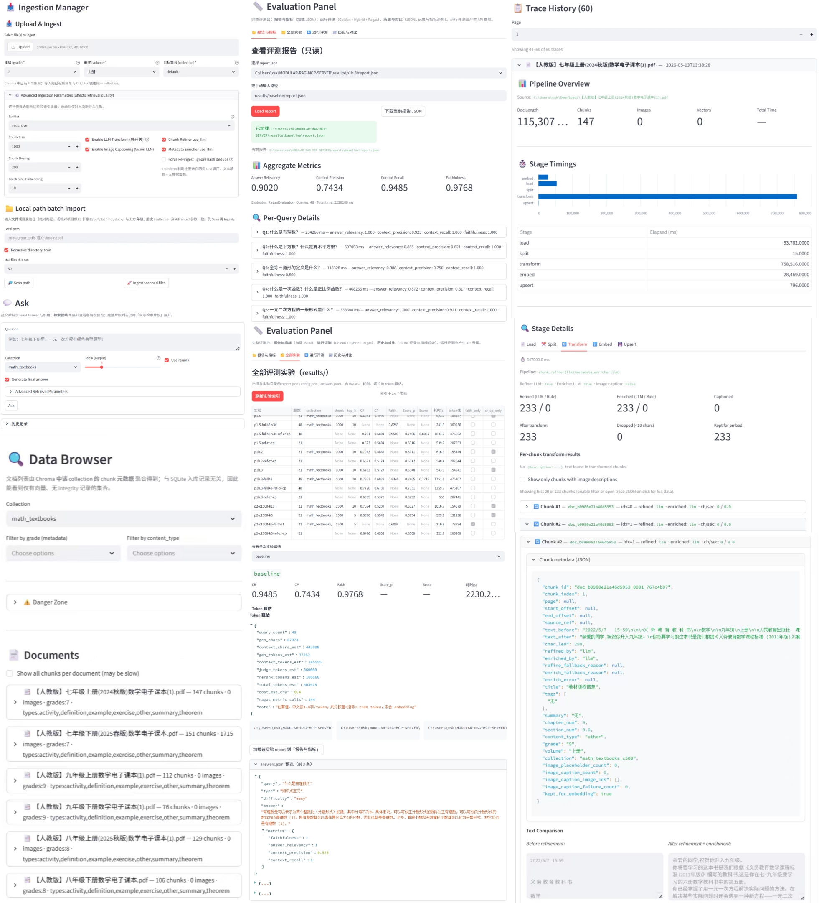

# MathRAG

**产品入口：[初中数学问一问](https://www.modelscope.cn/studios/KUNNventure/Math_Teaching_Material/summary)**

**项目简介：** 面向初中数学辅导场景（教培/家教快速查阅知识点）的模块化 RAG 系统，构建3000+chunks知识库，并通过三阶段消融将综合 Score 从 0.777 优化到 0.808。

**技术栈:** LLM-Enhanced Ingestion (ChunkRefiner + MetadataEnricher) | Hybrid Retrieval (Dense + BM25 + RRF) | LLM Rerank | RAGAS Eval Loop (@reference) | MCP Tooling (query/list/summary) | Streamlit Dashboard (Data Browser/Ingestion/Evaluation)

## 目录
- [消融表](#-消融表)
- [架构图](#-架构图)
- [工程构建](#-工程构建)
- [Dashboard 展示](#-dashboard展示功能简介)
- [三Phase决策/方法论](#-三phase-决策表方法论)
- [踩坑精选/详细资料](#-踩坑精选--详细资料)
- [快速开始](#-快速开始)

## ① 消融表


| 配置 | CR@ref | CP@ref | Faith(adj) | Score |
| --- | --- | --- | --- | --- |
| Dense-only (naive RAG) | 0.8056 | 0.6370 | 0.8784 | **0.7769** |
| Final (Hybrid + Rerank + Prompt v3.4) | 0.8066 | 0.6748 | 0.9440 | **0.8083** |
| **Delta** | +0.001 | **+0.038** | **+0.066** | **+0.031** |

- Score = `0.4 × CR + 0.3 × Faith(adj) + 0.3 × CP` Faith(adj)：边界合规拒答计 1，韦达场景“无法确定”计 1
- 评测口径：**48 题 Golden Set**，统一 `@reference`
- **增益(Dense-only → Final)：CP +6.0% / Faith +7.5%**

**各层贡献归因：**
检索层（Hybrid BM25 + LLM Rerank）主要提升 **CP +6.0%**，引入稀疏检索后术语精确匹配能力显著改善。生成层（Prompt v3.4 边界拒答）主要提升 **Faith +7.5%**，5 道超纲题（导数/虚数/正态分布等）从高风险幻觉改为规范拒答。

## ② 架构图



## ③ 工程构建

**1.LLM-Enhanced Ingestion（ChunkRefiner + MetadataEnricher）**

**情景**：教材 OCR 噪声和标题结构不稳定，纯规则会损失可读性和可检索标签。

**架构**：先进行规则清洗（噪声/页眉页脚/HTML/异常行）再进行 LLM 精修，并给 chunk 打 `refined_by/enriched_by`。

**效果**：支持 `title/summary/tags/content_type/grade` 等元数据过滤，减少跨年级召回噪声。

**2.Hybrid + LLM Rerank 检索链路**

**情景**：数学场景既有术语精确匹配需求，也有语义改写需求，单路检索不稳。

**架构**：Dense + BM25 双路召回，RRF 融合后接 LLM rerank（可开关）。

**效果**：同一评测口径下，系统从 Dense-only 从`0.7769` 迭代到 Final `0.8083`。

**3.自动化 RAGAS 评测流水线**

**情景**：迭代中识别出 CP 与答案耦合，Faith对边界问题评估失效导致分数不准，必须修正评测口径标准化再进行对比。

**架构**：构建 48 题 Golden Set 与 `scripts/run_ref_eval_pipeline.py` 一键流程（检索生成→@ref CR/CP→Faith 调整→合成评分）。    

**效果**：三阶段实验可重复、可回放、可对比，标准性强。

**4.Streamlit Dashboard 工程化面板**

**情景**：检索系统调优需要把数据状态、管线过程、评测结果放在一个反馈闭环里。

**架构**：构建DashBoard ` Data Browser / Ingestion Manager / Ask / Ingestion Traces / Query Traces / Evaluation Panel`六界面。

**效果**：支持参数在线实验、逐题下钻和 trace 回放，显著降低*实验排障成本。

**5.MCP Server 标准化接口**

**情景**：检索功能仅限于程序内部，日常使用繁琐，需要集成到其他平台方便调用。

**架构**：实现 `query_knowledge_hub`、`list_collections`、`get_document_summary` 三个工具。

**效果**：可直接被支持 MCP 的客户端调用，实现查询、集合发现、文档摘要检索。

## ④ Dashboard展示/功能简介
<p align="center"></p>

- `System Overview`：展示 collection 数量、总 chunk 数、ChunkRefiner LLM 占比、Ingestion/Query trace 数。
- `Data Browser`：按 `grade/content_type` 过滤，查看文档级 chunks、每个 chunk 的 metadata JSON 和图片预览。
- `Ingestion Manager`：支持 splitter/chunk 参数、Refiner+Enricher 开关、批量导入与本地路径扫描、collection 级入库管理。
- `Evaluation Panel`：加载历史实验 `report.json`、全量实验索引对比、Per-Query 下钻、token/cost 粗估与历史趋势回放。、

## ⑤ 三 Phase 决策表/方法论

| **Phase**  | **核心修改**                             | **关键数据**                                                                    | **决策**                         |
| ---------- | ------------------------------------ | --------------------------------------------------------------------------- | ------------------------------ |
| Phase 1 检索 | 调整 rerank、RRF 权重、top-k（含无 rerank 对照） | Dense-only 0.7769；无 rerank 全量 0.8057；Final 检索主线沿用 v2 rerank + RRF 1:1 + k10 | 保留 `v2 rerank + RRF 1:1 + k10` |
| Phase 2 切片 | 对比 `c1500 (k5/k7)` 与 `c1000` 主线      | `c1500-k5+v3.4` 子集调整 Score 0.695，低于 c1000 对照 0.710                          | 不采纳 c1500，维持 c1000             |
| Phase 3 生成 | Prompt 从 r0 到 r1/r2，强化边界拒答与合规回答      | r2：Faith raw 0.8189；Faith adj 0.9440；Final Score 0.8083                     | 采用 `v3.4-r2` 作为上线版本            |

**方法论总结**：  
先设计评测集（48题8类型）与三阶评测流程，跑全量 Baseline 得出分项数据（CR/CP/Faith + 难度分布），根据优化幅度排出 Phase 优先级

用 21 题子集快筛方向，再用 48 题全量做上线裁决，不达标方案及时止损

过程中识别出评估机制局限（CP耦合，边界Faith低估），针对性修正（@ref 重算 + Faith 调整规则）并重测比较（结果：排序约 86% 一致），方向性结论保持稳定

完整实验数据与决策推导 → `[RAG优化实验报告.md](docs/RAG优化实验报告.md)`

## ⑥ 踩坑精选/详细资料

**1) HierarchicalSplitter 止损**

**问题**：层级切分在真实教材上连续多轮修复后仍不稳定，产出一致性差。

**过程**：对比 `hierarchical` 与 `recursive` 在同口径评测表现，记录回归波动。

**决策**：主线切回 `RecursiveSplitter c1000/o200`。

**2) RAGAS CP 与 answer 耦合**

**问题**：同检索结果下，回答措辞变化导致 CP 波动，误导检索判断。

**过程**：复查评测链路后切换到 `@reference` 口径并统一重算。

**决策**：后续统一基于 `@reference` 做 CR/CP 比较。

**3) Vectors=0 双重 Bug**  

**问题**：导入完成但向量数为 0，表象一致却非单点故障。

**过程**：分离检索、入库、索引环节逐段排查，定位为两个独立问题叠加。

**决策**：补齐链路检查与回归验证。

- 完整踩坑记录（含更多复盘）→ `[RAG踩坑记录汇总.md](docs/RAG踩坑记录_汇总.md)`
- 可信度声明：评测数据冻结于 commit `e0a02f8`，48 题 `@reference` 口径，可通过 `scripts/run_ref_eval_pipeline.py` 复现
- 详细资料：
  - `[RAG优化实验报告.md](docs/RAG优化实验报告.md)`
  - `[results/_SCORES_AT_REF.json](results/_SCORES_AT_REF.json)`
  - `[scripts/run_ref_eval_pipeline.py](scripts/run_ref_eval_pipeline.py)`

## ⑦ 快速开始

```bash
# 1) 克隆项目
git clone <your-repo-url>
cd MathRAG

# 2) 本地运行准备（venv + 依赖 + .env）
python -m venv .venv; .\.venv\Scripts\Activate.ps1; pip install -e ".[dev]"
copy .env.example .env

# 3) 启动服务
python main.py
python scripts/start_dashboard.py
```
