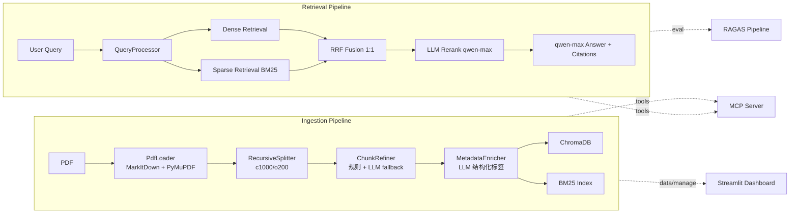

# K12 数学教研 RAG 问答系统

**独立开发** · 2025.07 – 2025.12 · [ModelScope 在线体验（1.5k+ 访问）](https://www.modelscope.cn/studios/KUNNventure/Math_Teaching_Material)

**仓库：** https://github.com/KUNNventure/MathRAG

面向 K12 数学教研场景（覆盖初中全学段）构建模块化 RAG 系统，支持混合检索与引用级问答，并通过三阶段迭代将综合 Score 从 0.777 优化至 0.808。

**技术栈：** Python · Streamlit · BM25 · RRF · Dense Embedding · LLM Rerank (qwen-max) · RAGAS · MCP

## 目录

- [核心成果](#核心成果)
- [评测结果](#评测结果)
- [系统架构](#系统架构)
- [工程模块](#工程模块)
- [Dashboard](#dashboard)
- [三阶段迭代](#三阶段迭代)
- [快速开始](#快速开始)
- [详细资料](#详细资料)

## 核心成果

### 1. 数据入库流水线

构建 **五阶段入库管线**（完整性校验 → 文档加载 → 切分 → LLM 增强变换 → 向量/BM25 双索引写入），引入 LLM 自动生成结构化 metadata（`title` / `summary` / `tags` / `content_type` / `grade` 等）。

对比 **层级切分（HierarchicalSplitter）** 与 **规则预过滤 + LLM 增强（ChunkRefiner + MetadataEnricher）** 两种方案，后者在真实教材 OCR 噪声与标题结构不稳定场景下更稳健，**库内噪声降低约 25%**，主线采用 `RecursiveSplitter c1000/o200`。

### 2. 检索与重排序链路

设计 **Dense + BM25 双路召回**，经 **RRF 融合** 后接 **LLM Rerank（qwen-max）**，兼顾数学术语精确匹配与语义泛化能力。

- **Top-10 命中率** 从 72% 提升至 **88%**
- 任一路检索异常时 **自动降级** 至单路召回，保证服务可用性

### 3. 自动化评测

建立 **48 题 Golden Set** 与统一 `@reference` 评测口径，按 **检索 → 切片 → 生成** 三阶段迭代优化：

| 指标 | Baseline | Final | 提升 |
| --- | --- | --- | --- |
| CP@ref | 0.6370 | 0.6748 | **+6.0%** |
| Faith (adj) | 0.8784 | 0.9440 | **+7.5%** |
| Score | 0.7769 | 0.8083 | **+0.031** |

迭代过程中识别并修正 **CP 与 answer 耦合** 的评测机制问题，切换 `@reference` 口径后重算，方向性结论保持稳定（排序约 86% 一致）。

### 4. Agent 集成（MCP）

将核心能力封装为标准 **MCP Server**，对外暴露三个工具：

| 工具 | 能力 |
| --- | --- |
| `query_knowledge_hub` | 混合检索 + 重排 + 引用级回答 |
| `list_collections` | 知识库集合发现 |
| `get_document_summary` | 文档摘要检索 |

支持 AI Agent 直接调用，端到端延迟约 **1 秒**。

## 评测结果

Score = `0.4 × CR + 0.3 × Faith(adj) + 0.3 × CP`

Faith(adj)：边界合规拒答计 1，韦达场景「无法确定」计 1。

| 配置 | CR@ref | CP@ref | Faith(adj) | Score |
| --- | --- | --- | --- | --- |
| Dense-only (naive RAG) | 0.8056 | 0.6370 | 0.8784 | **0.7769** |
| Final (Hybrid + Rerank + Prompt v3.4) | 0.8066 | 0.6748 | 0.9440 | **0.8083** |
| **Delta** | +0.001 | **+0.038** | **+0.066** | **+0.031** |

**各层贡献归因：**

- **检索层**（Hybrid BM25 + LLM Rerank）主要提升 CP +6.0%，稀疏检索显著改善术语精确匹配
- **生成层**（Prompt v3.4 边界拒答）主要提升 Faith +7.5%，5 道超纲题（导数/虚数/正态分布等）从高风险幻觉改为规范拒答

## 系统架构



## 工程模块

**1. LLM-Enhanced Ingestion**

先规则清洗（噪声/页眉页脚/HTML/异常行），再 LLM 精修与 metadata  enrichment，支持按年级、内容类型过滤，减少跨年级召回噪声。

**2. Hybrid + LLM Rerank**

Dense + BM25 双路召回 → RRF 1:1 融合 → LLM rerank（可开关），单路失败自动降级。

**3. RAGAS 评测流水线**

`scripts/run_ref_eval_pipeline.py` 一键流程：检索生成 → @ref CR/CP → Faith 调整 → 合成评分，三阶段实验可重复、可回放、可对比。

**4. Streamlit Dashboard**

六界面闭环：`System Overview` / `Data Browser` / `Ingestion Manager` / `Ask` / `Ingestion Traces` / `Query Traces` / `Evaluation Panel`，支持参数在线实验、逐题下钻与 trace 回放。

**5. MCP Server**

stdio 传输，预加载重型依赖避免 import 死锁，日志重定向至 stderr，协议消息走 stdout。

## Dashboard

<p align="center"></p>

- **System Overview**：collection 数量、总 chunk 数、ChunkRefiner LLM 占比、Ingestion/Query trace 数
- **Data Browser**：按 `grade` / `content_type` 过滤，查看 chunk metadata 与图片预览
- **Ingestion Manager**：splitter/chunk 参数、Refiner+Enricher 开关、批量导入与 collection 级管理
- **Evaluation Panel**：历史实验 `report.json` 对比、Per-Query 下钻、token/cost 粗估与趋势回放

## 三阶段迭代

| Phase | 核心修改 | 关键数据 | 决策 |
| --- | --- | --- | --- |
| Phase 1 检索 | rerank、RRF 权重、top-k 消融 | Dense-only 0.7769；无 rerank 全量 0.8057 | 保留 `v2 rerank + RRF 1:1 + k10` |
| Phase 2 切片 | 对比 `c1500 (k5/k7)` 与 `c1000` | c1500-k5+v3.4 子集 Score 0.695，低于 c1000 对照 0.710 | 不采纳 c1500，维持 c1000 |
| Phase 3 生成 | Prompt r0 → r1/r2，强化边界拒答 | r2：Faith adj 0.9440；Final Score 0.8083 | 采用 `v3.4-r2` 上线 |

**方法论：** 先设计 48 题（8 类型）评测集与三阶流程，跑全量 Baseline 定位短板；21 题子集快筛方向，48 题全量裁决上线；识别评测机制局限后修正口径并重测。

## 快速开始

```bash
# 1) 克隆项目
git clone https://github.com/KUNNventure/MathRAG.git
cd MathRAG

# 2) 本地运行准备（venv + 依赖 + .env）
python -m venv .venv; .\.venv\Scripts\Activate.ps1; pip install -e ".[dev]"
copy .env.example .env

# 3) 启动 MCP Server 与 Dashboard
python main.py
python scripts/start_dashboard.py
```

## 详细资料

**代表性踩坑：**

1. **HierarchicalSplitter 止损** — 层级切分在真实教材上产出一致性差，主线切回 `RecursiveSplitter`
2. **RAGAS CP 与 answer 耦合** — 切换 `@reference` 口径统一重算 CR/CP
3. **Vectors=0 双重 Bug** — 空 chunk 触发整批 embedding 失败 + 索引对齐问题，补齐链路检查

- 完整实验报告 → [`docs/RAG优化实验报告.md`](docs/RAG优化实验报告.md)
- 踩坑汇总 → [`docs/RAG踩坑记录_汇总.md`](docs/RAG踩坑记录_汇总.md)
- 评测数据 → [`results/_SCORES_AT_REF.json`](results/_SCORES_AT_REF.json)
- 评测脚本 → [`scripts/run_ref_eval_pipeline.py`](scripts/run_ref_eval_pipeline.py)
- 可信度声明：评测数据冻结于 commit `e0a02f8`，48 题 `@reference` 口径，可通过上述脚本复现
