# PROJECT_AWARENESS.md
> 基于完整源码通读生成的项目认知文档  
> 生成时间：2026-05-09 | 作者：Claude Code

---

## 目录

1. [项目定位](#1-项目定位)
2. [src/ 目录架构图（Mermaid）](#2-src-目录架构图mermaid)
3. [五大流水线入口与调用链](#3-五大流水线入口与调用链)
4. [配置可插拔的扩展点](#4-配置可插拔的扩展点)
5. [复用 / 改造 / 新增 清单](#5-复用--改造--新增-清单)
6. [风险点](#6-风险点)

---

## 1. 项目定位

MathRAG 是一个**可插拔、可观测**的模块化 RAG 服务框架，核心能力链路为：

```
PDF → Markdown → Chunk → Transform → Embedding → VectorStore
                                               ↓
Query → QueryProcessor → Dense+Sparse Retrieval → RRF Fusion → Rerank → MCP Response
```

对外通过 **MCP（Model Context Protocol）** 标准协议暴露三个工具接口，可直接被 GitHub Copilot / Claude Desktop 等客户端调用。

**技术关键词**：Hybrid Search · BM25 + Dense · RRF Fusion · Cross-Encoder/LLM Rerank · Image Captioning · Ragas Eval · Streamlit Dashboard · SQLite 持久化 · ChromaDB · Factory Pattern

---

## 2. src/ 目录架构图（Mermaid）

```mermaid
graph TB
    subgraph CORE["src/core — 核心契约与查询引擎"]
        TYPES["types.py\nDocument / Chunk / ChunkRecord\nProcessedQuery / RetrievalResult"]
        SETTINGS["settings.py\nload_settings() → frozen dataclasses\nLLM/Embedding/VectorStore/Retrieval\nRerank/Evaluation/Observability/Ingestion"]
        subgraph QE["query_engine/"]
            QP["query_processor.py\nQueryProcessor\n.process(query) → ProcessedQuery"]
            DR["dense_retriever.py\nDenseRetriever\n.retrieve(query, top_k) → [RetrievalResult]"]
            SR["sparse_retriever.py\nSparseRetriever\n.retrieve(keywords, top_k) → [RetrievalResult]"]
            FUSION["fusion.py\nRRFFusion\n.fuse(lists, top_k) → [RetrievalResult]"]
            HS["hybrid_search.py\nHybridSearch (orchestrator)\n.search(query) → [RetrievalResult]"]
            CR["reranker.py\nCoreReranker\n.rerank(query, results) → RerankResult"]
        end
        subgraph RESP["response/"]
            RB["response_builder.py\nResponseBuilder\n.build(results, query) → MCPToolResponse"]
            CG["citation_generator.py"]
            MA["multimodal_assembler.py"]
        end
        subgraph TRACE["trace/"]
            TC["trace_context.py\nTraceContext\n.record_stage(name, data)"]
            TCOL["trace_collector.py\nTraceCollector\n.collect(trace) → JSONL"]
        end
        ENV["env_guard.py\nvenv 校验"]
    end

    subgraph INGESTION["src/ingestion — 摄取流水线"]
        PIPE["pipeline.py\nIngestionPipeline (主编排器)\n.run(file_path) → PipelineResult\n6 个阶段顺序执行"]
        DMGR["document_manager.py\nDocumentManager\nlist/get/delete 文档生命周期"]
        subgraph CHUNK["chunking/"]
            DC["document_chunker.py\nDocumentChunker\n.split_document(doc) → [Chunk]"]
        end
        subgraph TRANSFORM["transform/"]
            BT["base_transform.py\nBaseTransform (ABC)\n.transform([Chunk]) → [Chunk]"]
            REFINER["chunk_refiner.py\nChunkRefiner extends BaseTransform\nLLM/Rule 双模式"]
            ENRICH["metadata_enricher.py\nMetadataEnricher extends BaseTransform\n注入 title/summary/tags"]
            CAPTION["image_captioner.py\nImageCaptioner extends BaseTransform\nVision LLM 生成图片描述"]
        end
        subgraph EMBED_ING["embedding/"]
            DENSE_ENC["dense_encoder.py\nDenseEncoder"]
            SPARSE_ENC["sparse_encoder.py\nSparseEncoder (BM25 term stats)"]
            BATCH["batch_processor.py\nBatchProcessor"]
        end
        subgraph STORAGE["storage/"]
            VU["vector_upserter.py\nVectorUpserter → ChromaDB"]
            BM25I["bm25_indexer.py\nBM25Indexer → pickle 持久化"]
            IMGS["image_storage.py\nImageStorage → SQLite image_index.db"]
        end
    end

    subgraph LIBS["src/libs — 可插拔后端实现"]
        subgraph LOADER["loader/"]
            BL["base_loader.py\nBaseLoader (ABC)\n.load(path) → Document"]
            PDFL["pdf_loader.py\nPdfLoader (MarkItDown)"]
            FI["file_integrity.py\nSQLiteIntegrityChecker\nSHA256 + ingestion_history.db"]
        end
        subgraph SPLITTER["splitter/"]
            BS["base_splitter.py\nBaseSplitter (ABC)\n.split_text(text) → [str]"]
            RS["recursive_splitter.py\nRecursiveSplitter (LangChain)"]
            SF["splitter_factory.py\nSplitterFactory\n_PROVIDERS 注册表 + .create(settings)"]
        end
        subgraph EMB["embedding/"]
            BE["base_embedding.py\nBaseEmbedding (ABC)\n.embed(texts) → [[float]]"]
            EF["embedding_factory.py\nEmbeddingFactory\n自动注册: openai/azure/ollama/qwen"]
            OAI_E["openai_embedding.py"]
            AZ_E["azure_embedding.py"]
            OLL_E["ollama_embedding.py"]
            QW_E["qwen_embedding.py"]
        end
        subgraph LLM_LIB["llm/"]
            BLLM["base_llm.py\nBaseLLM (ABC) + Message + ChatResponse\n.chat(messages) → ChatResponse"]
            BVLLM["base_vision_llm.py\nBaseVisionLLM (ABC)"]
            LLFACT["llm_factory.py\nLLMFactory"]
            LLMS["openai/azure/ollama/deepseek/qwen\n+ vision variants"]
        end
        subgraph RERANK["reranker/"]
            BR["base_reranker.py\nBaseReranker (ABC) + NoneReranker\n.rerank(query, candidates) → [dict]"]
            RF["reranker_factory.py\nRerankerFactory"]
            CE["cross_encoder_reranker.py\n⚠️ 框架已有，未完整测试"]
            LLMR["llm_reranker.py"]
        end
        subgraph VS["vector_store/"]
            BVS["base_vector_store.py\nBaseVectorStore (ABC)\n.upsert() / .query() / .get_by_ids()"]
            VSF["vector_store_factory.py"]
            CS["chroma_store.py\nChromaStore"]
        end
        subgraph EVAL_LIB["evaluator/"]
            BEVAL["base_evaluator.py\nBaseEvaluator (ABC) + NoneEvaluator\n.evaluate() → Dict[str,float]"]
            EVALF["evaluator_factory.py"]
            CEVAL["custom_evaluator.py\n⚠️ 框架已有，未完整测试"]
        end
    end

    subgraph MCP["src/mcp_server — MCP 协议层"]
        SRV["server.py\nrun_stdio_server()\nasyncio + stdio transport"]
        PH["protocol_handler.py\nProtocolHandler + create_mcp_server()\nToolDefinition 注册表"]
        subgraph TOOLS["tools/"]
            T1["query_knowledge_hub.py"]
            T2["list_collections.py"]
            T3["get_document_summary.py"]
        end
    end

    subgraph OBS["src/observability — 可观测性"]
        LOG["logger.py\nget_logger()"]
        subgraph DASH["dashboard/"]
            APP["app.py\nStreamlit 6页面入口"]
            PAGES["pages/\noverview / data_browser /\ningestion_manager / ingestion_traces /\nquery_traces / evaluation_panel / ask"]
            SVCS["services/\nconfig_service / data_service / trace_service"]
        end
        subgraph EVALRUN["evaluation/"]
            ER["eval_runner.py\nEvalRunner\n.run(test_set) → EvalReport"]
            RAGAS["ragas_evaluator.py\nRagasEvaluator\nfaithfulness/answer_relevancy/context_precision"]
            COMP["composite_evaluator.py"]
        end
    end

    %% 依赖关系
    PIPE --> TYPES
    PIPE --> SETTINGS
    PIPE --> FI
    PIPE --> PDFL
    PIPE --> DC
    PIPE --> REFINER & ENRICH & CAPTION
    PIPE --> BATCH
    PIPE --> VU & BM25I & IMGS
    PIPE --> TC

    DC --> SF
    SF --> BS
    SF --> RS

    DR --> BE
    DR --> BVS
    SR --> BM25I
    SR --> BVS

    HS --> QP & DR & SR & FUSION
    CR --> BR
    CR --> RF

    RB --> CG & MA

    TOOLS --> HS & CR & RB
    SRV --> PH
    PH --> TOOLS

    REFINER & ENRICH & CAPTION --> BT
    REFINER & ENRICH --> BLLM
    CAPTION --> BVLLM

    DENSE_ENC --> BE
    EF --> BE

    ER --> HS & CR & BEVAL
    RAGAS --> BEVAL

    DASH --> ER & TCOL
```



---

## 3. 五大流水线入口与调用链

### 3.1 Ingestion Pipeline

**CLI 入口**：`python scripts/ingest.py --path <pdf> --collection <name>`  
**代码入口**：`src/ingestion/pipeline.py` → `IngestionPipeline.run(file_path)`

```
scripts/ingest.py::main()
  └─ IngestionPipeline(settings, collection, force)
       ├─ [Stage 1] SQLiteIntegrityChecker.compute_sha256(file)
       │            .should_skip(hash) → 已处理则提前返回
       ├─ [Stage 2] PdfLoader.load(file_path) → Document
       │            (MarkItDown 解析 → canonical Markdown + image placeholders)
       ├─ [Stage 3] DocumentChunker.split_document(doc) → [Chunk]
       │            └─ SplitterFactory.create(settings)
       │                 └─ RecursiveSplitter.split_text(text)
       ├─ [Stage 4a] ChunkRefiner.transform([Chunk]) → [Chunk]    ← BaseTransform
       │             (LLM 去噪/合并 or 规则后备)
       ├─ [Stage 4b] MetadataEnricher.transform([Chunk]) → [Chunk] ← BaseTransform
       │             (LLM 生成 title/summary/tags or 规则后备)
       ├─ [Stage 4c] ImageCaptioner.transform([Chunk]) → [Chunk]  ← BaseTransform
       │             (Vision LLM 生成图片描述，缝入 chunk.text)
       ├─ [Stage 5] BatchProcessor.process([Chunk])
       │             ├─ DenseEncoder.encode_batch(texts) → [[float]]  ← EmbeddingFactory
       │             └─ SparseEncoder.encode_batch(texts) → [term_stats]
       ├─ [Stage 6a] VectorUpserter.upsert(chunks, dense_vectors) → [vector_ids]
       │             └─ VectorStoreFactory → ChromaStore
       ├─ [Stage 6b] BM25Indexer.add_documents(sparse_stats, collection, doc_id)
       │             ⚠️ 注意：需将 sparse_stats[i]["chunk_id"] = vector_ids[i]
       │             (BM25 hit ID 需与 ChromaDB vector ID 对齐)
       └─ [Stage 6c] ImageStorage.register_image(image_id, path, collection, doc_hash)
                    SQLiteIntegrityChecker.mark_success(hash)
```

全程可传入 `TraceContext`，每个阶段调用 `trace.record_stage(stage_name, data, elapsed_ms)`。

---

### 3.2 Retrieval Pipeline

**MCP 入口**：`tools/call → query_knowledge_hub`  
**代码入口**：`src/core/query_engine/hybrid_search.py` → `HybridSearch.search(query)`

```
MCP Client → query_knowledge_hub tool handler
  └─ HybridSearch.search(query, top_k, filters, trace)
       ├─ QueryProcessor.process(query) → ProcessedQuery
       │   (提取 keywords, filters, original_query)
       ├─ [并行 ThreadPoolExecutor max_workers=2]
       │   ├─ DenseRetriever.retrieve(query, top_k=dense_top_k, filters)
       │   │   └─ EmbeddingFactory → embed(query) → vector
       │   │       BaseVectorStore.query(vector, top_k) → [RetrievalResult]
       │   └─ SparseRetriever.retrieve(keywords, top_k=sparse_top_k, collection)
       │       └─ BM25Indexer.search(keywords) → [(chunk_id, score)]
       │           BaseVectorStore.get_by_ids([chunk_ids]) → [RetrievalResult]
       ├─ [Graceful Fallback] 任一路失败 → 使用另一路结果
       ├─ RRFFusion.fuse([dense, sparse], top_k=fusion_top_k)
       │   公式: score(d) = Σ 1/(k + rank(d)), k=rrf_k (默认60)
       ├─ _apply_metadata_filters(results, filters)  [后处理过滤]
       └─ 返回 List[RetrievalResult] (score = RRF score)

  ↓ (调用方可选接入 Reranker)
  CoreReranker.rerank(query, results, top_k)
  ResponseBuilder.build(results, query) → MCPToolResponse
```

---

### 3.3 RRF Fusion

**代码入口**：`src/core/query_engine/fusion.py` → `RRFFusion.fuse(ranking_lists, top_k)`

```python
# 核心算法（纯函数，无副作用）
for list_idx, ranking_list in enumerate(non_empty_lists):
    for rank, result in enumerate(ranking_list, start=1):
        rrf_scores[result.chunk_id] += 1.0 / (self.k + rank)

fused_results.sort(key=lambda r: (-r.score, r.chunk_id))  # 稳定排序
return fused_results[:top_k]
```

**扩展方法**：`fuse_with_weights(ranking_lists, weights, top_k)` — 支持对不同来源分配权重（如 dense×1.5, sparse×1.0）

k 值来源：`settings.retrieval.rrf_k`，默认 60（遵循原论文推荐值）

---

### 3.4 Reranker

**代码入口**：`src/core/query_engine/reranker.py` → `CoreReranker.rerank(query, results, top_k)`

```
CoreReranker.rerank(query, results, top_k)
  ├─ 若 disabled 或 NoneReranker → 直接截断返回 results[:top_k]
  ├─ _results_to_candidates(results) → [{id, text, score, metadata}]
  ├─ BaseReranker.rerank(query, candidates, trace) via RerankerFactory
  │   ├─ LLMReranker    → 调用 LLM 对每条 candidate 打分排序
  │   ├─ CrossEncoderReranker → sentence-transformers 交叉编码打分
  │   └─ NoneReranker   → 原序返回
  ├─ _candidates_to_results(reranked, original) → [RetrievalResult]
  │   (新增 metadata.reranked=True, original_score, rerank_score)
  └─ 失败时 fallback_on_error=True → 返回原序 + metadata.rerank_fallback=True
```

**当前状态**：LLMReranker 可用，CrossEncoderReranker 框架已有但**未完整测试**（需本地模型）

---

### 3.5 Evaluation (Ragas)

**CLI 入口**：`python scripts/evaluate.py`  
**代码入口**：`src/observability/evaluation/eval_runner.py` → `EvalRunner.run(test_set_path)`

```
scripts/evaluate.py::main()
  └─ EvalRunner.run(golden_test_set.json, top_k=10)
       ├─ load_test_set(path) → [GoldenTestCase]
       │   格式: {query, expected_chunk_ids, expected_sources, reference_answer}
       ├─ for each GoldenTestCase:
       │   ├─ HybridSearch.search(query, top_k) → [RetrievalResult]
       │   ├─ [可选] CoreReranker.rerank(query, results)
       │   ├─ answer_generator(query, chunks) → str
       │   │   (自定义函数 or 默认: 拼接前5个 chunk 文本)
       │   └─ BaseEvaluator.evaluate(query, chunks, answer, ground_truth)
       │       └─ RagasEvaluator._run_ragas(query, contexts, answer)
       │           ├─ Faithfulness.score(user_input, response, retrieved_contexts)
       │           ├─ AnswerRelevancy.score(user_input, response)
       │           └─ ContextPrecisionWithoutReference.score(...)
       ├─ _aggregate_metrics([QueryResult]) → 各指标均值
       └─ → EvalReport {query_results, aggregate_metrics, total_elapsed_ms}
```

评估结果写入 `logs/eval_history.jsonl`，Dashboard `evaluation_panel` 页面读取展示。

---

## 4. 配置可插拔的扩展点

### 4.1 Splitter — 基类与注册机制

**基类**：`src/libs/splitter/base_splitter.py::BaseSplitter`
```python
class BaseSplitter(ABC):
    @abstractmethod
    def split_text(self, text: str, trace=None, **kwargs) -> List[str]: ...
    def validate_text(self, text: str) -> None: ...   # 已实现
    def validate_chunks(self, chunks: List[str]) -> None: ...  # 已实现
```

**注册机制**：`SplitterFactory._PROVIDERS: dict[str, type[BaseSplitter]]`
```python
SplitterFactory.register_provider("semantic", SemanticSplitter)
# 然后在 settings.yaml 中设置 ingestion.splitter: "semantic"
```
工厂在模块导入时自动调用 `_register_builtin_providers()`，注册 "recursive"。

**实例化路径**：`SplitterFactory.create(settings)` → `provider_class(settings=settings)`

---

### 4.2 Embedding — Provider 模式

**基类**：`src/libs/embedding/base_embedding.py::BaseEmbedding`
```python
class BaseEmbedding(ABC):
    @abstractmethod
    def embed(self, texts: List[str], trace=None, **kwargs) -> List[List[float]]: ...
    def get_dimension(self) -> int: ...   # 建议 override
    def validate_texts(self, texts): ... # 已实现
```

**Factory 注册**：`EmbeddingFactory._PROVIDERS`，模块导入时自动注册 openai/azure/ollama/qwen
```python
EmbeddingFactory.register_provider("cohere", CohereEmbedding)
# settings.yaml: embedding.provider: "cohere"
```

**实例化路径**：`EmbeddingFactory.create(settings)` → `provider_class(settings=settings)`

---

### 4.3 Reranker — 扩展接口

**基类**：`src/libs/reranker/base_reranker.py::BaseReranker`
```python
class BaseReranker(ABC):
    @abstractmethod
    def rerank(self, query: str, candidates: List[Dict], trace=None, **kwargs) -> List[Dict]: ...
    # candidates 格式: [{id, text, score, metadata}]
    # 返回格式：同上，增加 "rerank_score" 字段，按相关性降序
    def validate_query(self, query): ...    # 已实现
    def validate_candidates(self, candidates): ...  # 已实现
```

**内置实现**：
- `NoneReranker` — 原序返回（无状态）
- `LLMReranker` — 调用 LLMFactory 创建的 LLM 进行打分
- `CrossEncoderReranker` — ⚠️ 框架已有，需本地 sentence-transformers 模型才能完整运行

**注册**：`RerankerFactory._PROVIDERS`，通过 `settings.rerank.provider` 选择

---

### 4.4 Loader — 基类分析与统一接口

**基类（已存在）**：`src/libs/loader/base_loader.py::BaseLoader`
```python
class BaseLoader(ABC):
    @abstractmethod
    def load(self, file_path: str | Path) -> Document: ...
    @staticmethod
    def _validate_file(file_path) -> Path: ...  # 已实现，校验文件存在性
```

**当前状态**：BaseLoader **已经存在且完整**，`PdfLoader` 是唯一实现。  
**问题**：Loader **没有对应的 Factory**。`IngestionPipeline.__init__` 中直接硬编码实例化 `PdfLoader`：
```python
self.loader = PdfLoader(extract_images=True, ...)
```

**如果要扩展**（新增 Word/Markdown Loader），需要：
1. 实现 `BaseLoader` 子类
2. 新增 `LoaderFactory`（按 file extension 或 settings.ingestion.loader_type 分发）
3. 修改 `IngestionPipeline.__init__` 改为工厂调用

**设计建议（LoaderFactory 草稿）**：
```python
# src/libs/loader/loader_factory.py
class LoaderFactory:
    _PROVIDERS: dict[str, type[BaseLoader]] = {}
    
    @classmethod
    def register_provider(cls, ext: str, loader_class: type[BaseLoader]):
        cls._PROVIDERS[ext.lower()] = loader_class
    
    @classmethod
    def create_for_file(cls, file_path: str, settings: Settings) -> BaseLoader:
        ext = Path(file_path).suffix.lower()
        loader_class = cls._PROVIDERS.get(ext)
        if loader_class is None:
            raise ValueError(f"No loader registered for extension: {ext}")
        return loader_class(settings=settings)

# 自动注册
LoaderFactory.register_provider(".pdf", PdfLoader)
```

---

### 4.5 Transform — 扩展接口

**基类**：`src/ingestion/transform/base_transform.py::BaseTransform`
```python
class BaseTransform(ABC):
    @abstractmethod
    def transform(self, chunks: List[Chunk], trace=None) -> List[Chunk]: ...
```

**内置实现**：`ChunkRefiner` / `MetadataEnricher` / `ImageCaptioner`（均在 `src/ingestion/transform/`）  
**注意**：Transform 没有 Factory 也没有注册机制，`IngestionPipeline.__init__` 直接硬编码三个 transform 实例。如需增加新 Transform，需要修改 Pipeline。

---

### 4.6 VectorStore — 扩展接口

**基类**：`src/libs/vector_store/base_vector_store.py::BaseVectorStore`
```python
class BaseVectorStore(ABC):
    @abstractmethod
    def upsert(self, records: List[Dict], trace=None, **kwargs) -> None: ...
    @abstractmethod
    def query(self, vector: List[float], top_k: int, filters=None, ...) -> List[Dict]: ...
    # 可选 override：
    def delete(self, ids, ...) -> None: ...         # 默认 raise NotImplementedError
    def clear(self, collection_name, ...) -> None: ...  # 默认 raise NotImplementedError
    def get_by_ids(self, ids, ...) -> List[Dict]: ...   # SparseRetriever 必需！
```

目前只有 `ChromaStore` 实现了完整接口（含 `get_by_ids`）。

---

### 4.7 Evaluator — 扩展接口

**基类**：`src/libs/evaluator/base_evaluator.py::BaseEvaluator`
```python
class BaseEvaluator(ABC):
    @abstractmethod
    def evaluate(self, query, retrieved_chunks, generated_answer=None,
                 ground_truth=None, trace=None, **kwargs) -> Dict[str, float]: ...
```

**内置实现**：
- `NoneEvaluator` — 返回 `{}`
- `CustomEvaluator` — ⚠️ 框架已有，未完整测试
- `RagasEvaluator`（在 `src/observability/evaluation/`）— 完整实现，需 `pip install ragas`

**RagasEvaluator 支持的指标**：`faithfulness` / `answer_relevancy` / `context_precision`

---

## 5. 复用 / 改造 / 新增 清单

### 复用（稳定，直接使用）

| 模块 | 文件 | 说明 |
|------|------|------|
| 核心类型契约 | `src/core/types.py` | Document/Chunk/ChunkRecord/ProcessedQuery/RetrievalResult，全链路共享，非常稳定 |
| Settings 加载 | `src/core/settings.py` | YAML → frozen dataclasses，load_settings() 已经完整 |
| RRF 融合算法 | `src/core/query_engine/fusion.py` | 纯函数，零副作用，可直接复用 |
| Trace 基础设施 | `src/core/trace/` | TraceContext + TraceCollector，接口已定型 |
| 所有 base_*.py | `src/libs/*/base_*.py` | BaseSplitter/BaseEmbedding/BaseLLM/BaseReranker/BaseVectorStore/BaseEvaluator/BaseLoader/BaseTransform |
| 所有 Factory | `src/libs/*/.*_factory.py` | 注册机制成熟，直接调用 |
| LLM 实现层 | `src/libs/llm/` | openai/azure/ollama/deepseek/qwen + vision，可直接使用 |
| Embedding 实现层 | `src/libs/embedding/` | openai/azure/ollama/qwen，直接使用 |
| BM25Indexer | `src/ingestion/storage/bm25_indexer.py` | BM25 索引管理，接口稳定 |
| ChromaStore | `src/libs/vector_store/chroma_store.py` | 完整实现 upsert/query/get_by_ids/delete/clear |
| RagasEvaluator | `src/observability/evaluation/ragas_evaluator.py` | 完整实现，可直接接入 |
| MCP 协议层 | `src/mcp_server/` | server + protocol_handler + 三个 tool，接口稳定 |
| Dashboard 基础框架 | `src/observability/dashboard/` | 6页面 Streamlit，基于 trace 动态渲染 |

---

### 改造（需修改，方向明确）

| 模块 | 文件 | 改造方向 |
|------|------|---------|
| Ingestion Pipeline | `src/ingestion/pipeline.py` | ① 第145行：将硬编码 `PdfLoader` 替换为 `LoaderFactory.create_for_file(file_path, settings)`（需 loader 延迟到 `run()` 时创建）；② Transform 列表可配置化；③ 存储路径参数化 |
| `query_knowledge_hub` 工具 | `src/mcp_server/tools/query_knowledge_hub.py` | ⚠️ **当前无 LLM 生成步骤**（已读源码确认：流程止于 `ResponseBuilder.build()`，仅格式化 Markdown）；需在 `_apply_rerank` 之后新增 `_generate_teaching_answer()`（Teaching Prompt + LLMFactory）；同步扩展 `TOOL_INPUT_SCHEMA` 增加 grade/volume/chapter_num 过滤参数 |
| HybridSearch 过滤字段 | `src/core/query_engine/hybrid_search.py` | `_matches_filters()` 当前仅支持 collection/source_collection/doc_type/tags/source_path；需增加 `grade` / `volume` / `chapter_num`（人教版教材专属元数据维度） |
| CrossEncoderReranker | `src/libs/reranker/cross_encoder_reranker.py` | 完成本地模型集成测试（需下载 cross-encoder/ms-marco-MiniLM-L-6-v2） |
| CustomEvaluator | `src/libs/evaluator/custom_evaluator.py` | 实现 hit_rate@k / MRR；结合数学家教黄金测试集（30-40 条）验证；用于三项对比实验：RecursiveSplitter vs HierarchicalSplitter、Dense-only vs BM25-only vs Hybrid(RRF) |
| RagasEvaluator | `src/observability/evaluation/ragas_evaluator.py` | 扩展支持更多指标（如 context_recall），当前仅支持3个 |
| Loader (扩展) | `src/libs/loader/` | 新增 LoaderFactory + 按 file extension 分发（支持 Word/Markdown/HTML） |
| settings.yaml | `config/settings.yaml` | ⚠️ 当前含真实 API Key（sk-4dba...），部署前需移除或使用 env 变量替换；同步增加 `teaching_prompt_path`、`loader_type` 配置项 |

---

### 新增（尚未实现）

| 新增模块 | 说明 |
|---------|------|
| `src/libs/loader/textbook_loader.py` | 继承 BaseLoader；解析人教版数学教材 PDF；在 `Document.metadata` 中注入 grade/volume/publisher/textbook_structure（含目录树）；供 HierarchicalSplitter 使用 |
| `src/libs/loader/loader_factory.py` | 按文件扩展名路由到对应 Loader（`.pdf` → TextbookLoader 或 PdfLoader，按 `settings.ingestion.loader_type` 决定），参见 §4.4 草稿 |
| `src/libs/splitter/hierarchical_splitter.py` | **用户设计接口，Claude 实现**；4层层级切分（章/节/课时/知识点），extends BaseSplitter；注册至 `SplitterFactory("hierarchical")`；每个 chunk metadata 携带 chapter_num/section_num/level/breadcrumb；`settings.yaml: ingestion.splitter: "hierarchical"` |
| `src/api/` 目录 | FastAPI 服务层：`POST /query`（SSE 流式输出）+ `POST /ingest` + `GET /collections`；routes / middlewares（Redis 缓存 + 限流）/ services / schemas；FAQ 沉淀（高频问题写入 SQLite faq.db）；与 MCP 层并行，面向前端/移动端 |
| `tests/fixtures/golden_test_set.json` | 数学家教黄金测试集，30-40 条知识点查询 + expected_chunk_ids + reference_answer；用于 hit_rate@k / MRR 对比实验 |
| `config/prompts/teaching_prompt.txt` | Teaching Prompt 模板（系统 + 用户 Prompt）；独立文件方便调整，无需改代码；供 `_generate_teaching_answer()` 读取 |
| `src/libs/loader/markdown_loader.py` | 实现 BaseLoader，解析 .md 文件 → Document |
| `src/libs/loader/word_loader.py` | 实现 BaseLoader，使用 python-docx 解析 .docx |
| `src/mcp_server/tools/ingest_document.py` | 新增 MCP Tool，通过 API 触发摄取 |
| Agent Client 层 | 独立于本项目，调用 MCP Tools，实现 ReAct / Tool Calling 逻辑 |

---

## 6. 风险点

### 6.1 改动影响链分析

| 改动目标 | 影响范围 | 风险等级 |
|---------|---------|---------|
| `src/core/types.py` 中任何 dataclass 字段变更 | 全项目所有模块（ingestion + retrieval + mcp + dashboard + eval） | 🔴 极高 |
| `src/core/settings.py` 新增/删除 settings 字段 | 对应 settings.yaml + 所有读取该字段的模块 | 🟠 高 |
| `TraceContext.record_stage()` 的 stage_name 或 data schema | Dashboard 所有页面（基于 stage name 动态渲染） | 🟠 高 |
| BM25 `chunk_id` 与 ChromaDB `vector_id` 的对齐逻辑 | `pipeline.py:441-443` → SparseRetriever → 检索结果正确性 | 🟠 高 |
| `BaseVectorStore.get_by_ids()` 接口 | SparseRetriever 强依赖此方法获取文本和 metadata | 🟠 高 |
| `IngestionPipeline.__init__` 硬编码的存储路径 | 多集合部署时路径冲突 | 🟡 中 |
| `HybridSearch._run_parallel_retrievals` max_workers=2 | 并发性能（非功能影响，只影响吞吐） | 🟢 低 |
| `ResponseBuilder` 中文硬编码 UI 字符串 | 仅影响 MCP 响应展示，不影响逻辑 | 🟢 低 |

---

### 6.2 原作者预留的扩展接口

| 扩展点 | 位置 | 说明 |
|-------|------|------|
| `SplitterFactory.register_provider()` | `src/libs/splitter/splitter_factory.py:48` | 运行时注册新策略 |
| `EmbeddingFactory.register_provider()` | `src/libs/embedding/embedding_factory.py:35` | 运行时注册新 Embedding |
| `RerankerFactory.register_provider()` | `src/libs/reranker/reranker_factory.py` | 运行时注册新 Reranker |
| `VectorStoreFactory.register_provider()` | `src/libs/vector_store/vector_store_factory.py` | 运行时注册新 VectorStore 后端 |
| `EvaluatorFactory.register_provider()` | `src/libs/evaluator/evaluator_factory.py` | 运行时注册新 Evaluator |
| `RRFFusion.fuse_with_weights()` | `src/core/query_engine/fusion.py:181` | 加权 RRF，原作者预留但主流程未使用 |
| `IngestionPipeline.run(on_progress=...)` | `src/ingestion/pipeline.py:209` | 进度回调，Dashboard 已接入 |
| `EvalRunner(answer_overrides=...)` | `src/observability/evaluation/eval_runner.py:168` | 覆盖特定测试用例的答案 |
| `HybridSearch(config=HybridSearchConfig(...))` | `src/core/query_engine/hybrid_search.py:139` | 细粒度控制 enable_dense/enable_sparse/parallel |

---

### 6.3 硬编码项清单

以下是需要重点关注的硬编码内容，改造时可能需要参数化：

| 硬编码内容 | 位置 | 建议改造方式 |
|-----------|------|------------|
| 存储路径 `data/db/ingestion_history.db` | `pipeline.py:141` | 提取至 settings |
| 存储路径 `data/db/bm25/{collection}` | `pipeline.py:186` | 同上 |
| 存储路径 `data/db/image_index.db` | `pipeline.py:192` | 同上 |
| 图片目录 `data/images/{collection}` | `pipeline.py:148` | 同上 |
| `_total_stages = 6` | `pipeline.py:218` | Transform 列表可配置后需动态计算 |
| `max_workers=2` 并行检索 | `hybrid_search.py:447` | 提取至 HybridSearchConfig |
| 过滤字段名 `collection` / `source_collection` / `doc_type` | `hybrid_search.py:719` | 需与存储层 metadata key 约定一致 |
| BM25 使用 pickle 持久化 | `bm25_indexer.py` | DEV_SPEC 中注明可迁移至 SQLite |
| RagasEvaluator 仅支持3个指标 | `ragas_evaluator.py:28` | `SUPPORTED_METRICS` 可扩展 |
| 响应 UI 中文字符串 | `response_builder.py:220-230` | 国际化需参数化 |
| MarkItDown 作为唯一 PDF 解析器 | `pdf_loader.py` + `pipeline.py:145` | 引入 LoaderFactory 后可替换 |
| LLM Reranker 的 prompt 模板 | `llm_reranker.py` | 提取为可配置模板 |

---

### 6.4 未完整实现的模块（使用前需完善）

| 模块 | 状态 | 需要做什么 |
|------|------|-----------|
| `CrossEncoderReranker` | 框架已有，未测试 | 下载 `cross-encoder/ms-marco-MiniLM-L-6-v2`，完成集成测试 |
| `CustomEvaluator` | 框架已有，未测试 | 实现 hit_rate@k / MRR；使用 `tests/fixtures/golden_test_set.json`（数学家教黄金集）；执行三项对比实验后得出最优配置 |
| `settings.yaml` API Key | ⚠️ 含真实密钥 | 生产环境需用 env var 替换 `api_key` 字段 |

---


*END OF PROJECT_AWARENESS.md*
